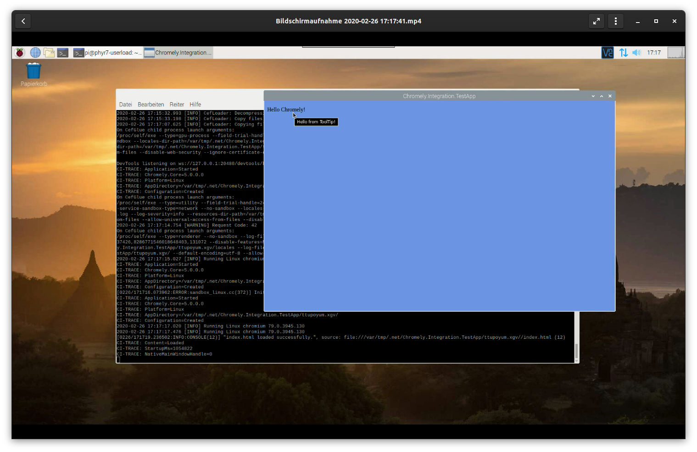

# Chromely on Raspberry Pi

From Chromely version v5 up we support Raspberry Pi's **linux-arm** as target platform.

To publish for this platform use the following command.

    dotnet publish -c Release -f netcoreapp3.1 -r linux-arm -p:PublishSingleFile=true -p:PublishTrimmed=true

Call it from the directory where the project is.

It will create a single file executable for Raspberry Pi use.

**Warning!**    
The download and unpack process on the PI is slow and may take several minutes - be patient.

